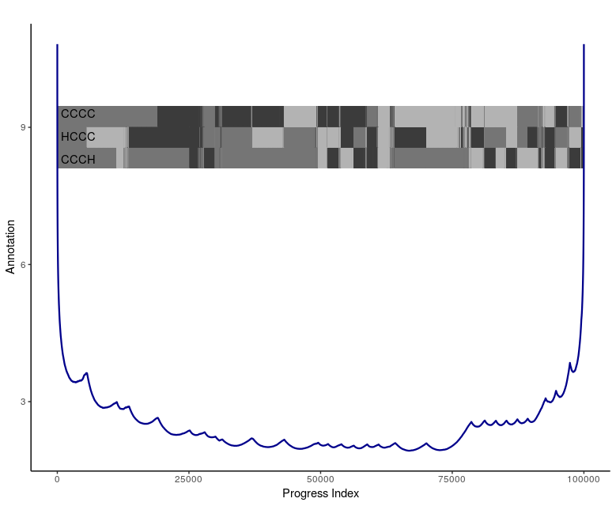

```{r setup, include=FALSE}
knitr::opts_chunk$set(echo = TRUE)
knitr::opts_knit$set(progress = FALSE)
# knitr::opts_knit$set(root.dir="out_to_del/")
# print(getwd())
```


This tutorial can be viewed as a follow-up to Tutorial 10, as it covers the analysis of a trajectory with rather specific tasks in mind. Specifically, here we wish to run clustering and related algorithms on a trajectory of a toy system (n-butane) exhibiting clear and intuitive state partitioning.


## Step 1 - Generating a suitable trajectory

The molecule under study, n-butane, is so small that it is feasible and convenient to generate a statistically meaningful trajectory within this tutorial. Since some of the algorithms tested here respond to kinetics, we will obtain a stochastic dynamics trajectory in torsional space via the following key-file:

<div class="panel panel-info">
<div class="panel-heading">nbu_simulation.key</div>
<div class="panel-body">

```{bash, eval=FALSE}
PARAMETERS <full path to folder>/campari/params/oplsaal.prm
FMCSC_SEQFILE nbu.in
FMCSC_BASENAME NBU
FMCSC_SC_IPP 0.0
FMCSC_SC_BONDED_T 1.0
FMCSC_DYNAMICS 3
FMCSC_FRICTION 3.0 # 1/ps
FMCSC_TIMESTEP 0.005 # ps
FMCSC_TEMP 400.0 # K
FMCSC_NRSTEPS 10000000
FMCSC_EQUIL 0
FMCSC_XYZOUT 100
FMCSC_XYZPDB 3
FMCSC_TOROUT 100
FMCSC_COVCALC 20000000 # disable
FMCSC_SAVCALC 20000000 # disable
FMCSC_POLCALC 20000000 # disable
FMCSC_RHCALC 20000000 # disable
FMCSC_INTCALC 20000000 # disable
FMCSC_POLOUT 20000000 # disable
FMCSC_ENSOUT 20000000 # disable
FMCSC_ENOUT 20000000 # disable
FMCSC_RSTOUT 20000000 # disable
```

ps: nbu.in is a file containing only the following words in two different lines: NBU END

For more information check [Tutorial 11: Structural Clustering and Related Methods in CAMPARI](http://campari.sourceforge.net/V3/tutorial11.html)
</div>
</div> 

This key-file can be read directly in an R session using the keywords_from_keyfile() function. Please remember that the above formatting should be stricly followed (the commented and empty lines are automatically discarded).
```{r, eval=FALSE}
# reading an already formatted keyfile (it will skip the empty lines and comments)
keywords <- keywords_from_keyfile(key_file_input = "nbu_simulation.key") # list format (keywords_names = values)
keywords_from_keyfile(key_file_input = "nbu_simulation.key", return_string_of_arguments = TRUE) # copy paste format

```

Using run_campari() as follows, it is possible to call the original CAMPARI executable (you MUST have it installed), according to the input variables. Please consider that checks on the input keywords are only partial and they will be principally delivered to CAMPARI's keywords checkings.

```{r, eval=FALSE}
# standard run of the simulation in tutarial 11 - In this case we copy pasted the nbu_simulation.key
run_campari(FMCSC_SEQFILE="nbu.in", # you must have it defined according to CAMPARI's rules
            # FMCSC_BASENAME="NBU", # lets try the base_name option
            base_name = "NBU", print_status = F, # it will take 55 s in background ~
            PARAMETERS="oplsaal.prm", # if this variable it is not supplied will be automatically assigned to <full path to folder>/campari/params/abs3.2_opls.prm
            FMCSC_SC_IPP=0.0,
            FMCSC_SC_BONDED_T=1.0,
            FMCSC_DYNAMICS=3,
            FMCSC_FRICTION=3.0,
            FMCSC_TIMESTEP=0.005,
            FMCSC_TEMP=400.0,
            FMCSC_NRSTEPS=10000000,
            FMCSC_EQUIL=0,
            FMCSC_XYZOUT=100,
            FMCSC_XYZPDB=3,
            FMCSC_TOROUT=100,
            FMCSC_COVCALC=20000000,
            FMCSC_SAVCALC=20000000,
            FMCSC_POLCALC=20000000,
            FMCSC_RHCALC=20000000,
            FMCSC_INTCALC=20000000,
            FMCSC_POLOUT=20000000,
            FMCSC_ENSOUT=20000000,
            FMCSC_ENOUT=20000000,
            FMCSC_RSTOUT=20000000
)
```
__NB__: if PARAMETERS is not assigned to oplsaal.prm, in this case will be automatically defined using abs3.2_opls.prm with the following error/warning: "No applicable assignments for torsional angle potentials found in parameter file <full path to folder>/campari/params/abs3.2_opls.prm". In this case this will lead to unconsistent results in the future analysis of metastable basins.

__NB2__: here the PARAMETERS var can be the full path or only the parameter file name (e.g. "olsaal.prm"). In this second case the executable folder will be used to look for the provided parameter file.

Let's rename some of the results:
```{bash, eval=FALSE}
mv NBU_traj.dcd NBU.dcd
mv FYC.dat NBU.fyc
```

This generates a dcd-trajectory of 50ns length with structures saved every 0.5ps (100000 snapshots). The degrees of freedom are the central torsion angle (C-C-C-C) and the two methyl spins (all-atom representation), which are all independent of one another on account of the Hamiltonian chosen (purely torsional potentials). The simulation itself should take no longer than 5-15 minutes on a modern desktop machine. Aside from the trajectory ("NBU.dcd"), an auxiliary output file is produced listing the actual values for the three torsional angles for every trajectory snapshot in columns 2-3-4 (renamed to NBU.fyc).


## Step 2 - Simple clustering

Clustering, i.e., the grouping of similar objects (here, trajectory snapshots that represent molecular conformations) into sets, is a task that - without additional constraints - lacks universal criteria of optimality or appropriateness, and therefore requires considerable user input. In CAMPARI, clustering is performed as a post-processing operation on selected features of a trajectory extracted during an analysis run (this example) or during a simulation (feature extraction on-the-fly). This means that there are some possible memory limitations on very large data sets (CAMPARI does not yet support stream-like handling of trajectories within the clustering routines), e.g., when extracting 107 instances of 100 double precision numbers each from a trajectory, the memory requirement already has a lower bound of 8 · 109 bytes (8GB).
The most basic keywords required for an analysis run with structural clustering here are as follows:

<div class="panel panel-info">
<div class="panel-heading">nbu_clustering.key</div>
<div class="panel-body">

```{bash, eval=FALSE}
FMCSC_SEQFILE nbu.in
PARAMETERS <full path to folder>/campari/params/oplsaal.prm
FMCSC_PDBANALYZE 1
FMCSC_DCDFILE NBU.dcd
FMCSC_PDB_FORMAT 4
FMCSC_SC_IPP 0.0
FMCSC_NRSTEPS 100000
FMCSC_EQUIL 0

# You could put the above in a new key-file, and it should run through fine. However, default algorithm, feature selection, and parameters are not appropriate for this system, which is why the results are most likely meaningless. Instead, we first add specific requests:

FMCSC_CCOLLECT 1 # use every snapshot
FMCSC_CMODE 5 # use tree-like algorithm
FMCSC_CDISTANCE 1 # use dihedral angles to represent each snapshot
FMCSC_CRADIUS 60.0 # threshold radius (in degrees) of clusters
FMCSC_BIRCHHEIGHT 8 # tree height
FMCSC_CMAXRAD 120.0 # coarsest threshold level in tree

FMCSC_XYZOUT 20000000 # disable
FMCSC_TOROUT 20000000 # disable
FMCSC_COVCALC 20000000 # disable
FMCSC_SAVCALC 20000000 # disable
FMCSC_POLCALC 20000000 # disable
FMCSC_RHCALC 20000000 # disable
FMCSC_INTCALC 20000000 # disable
FMCSC_POLOUT 20000000 # disable
FMCSC_ENSOUT 20000000 # disable
FMCSC_ENOUT 20000000 # disable
FMCSC_RSTOUT 20000000 # disable

```

For more information check [Tutorial 11: Structural Clustering and Related Methods in CAMPARI](http://campari.sourceforge.net/V3/tutorial11.html)
</div>
</div> 
Here, we select the tree-like algorithm of Vitalis and Caflisch via keyword FMCSC_CMODE. Details are provided in the corresponding documentation and of course in the reference publication. As a choice of representation ("feature selection"), we pick all dihedral angles of the system (the natural degrees of freedom for our sampling engine here). By supplying both FMCSC_CDISTANCE and an auxiliary input file for FMCSC_CFILE, it is possible to select subsets of features (for example, for n-butane one could cluster purely based on the central torsion angle). How this is done in detail is explained elsewhere. The last two options control parameters of the tree-based algorithm, i.e., its height (FMCSC_BIRCHHEIGHT) and a coarse threshold radius that should correspond roughly to the maximum pairwise distance observed between snapshots (FMCSC_CMAXRAD). Finally, the choice for FMCSC_CRADIUS sets a threshold radius parameter for the final clusters obtained (all algorithms in CAMPARI currently offer control over cluster size rather than cluster number). Here, the chosen value of 60.0° corresponds to the expected results for this system. Specifically, the torsional potentials partition every dihedral angle into three well-defined states spaced 120° apart. This means that we expect 3^3=27 well-defined states overall with 9 of those being more likely than the other 18 due to the central torsion angle energetically favoring the anti state over the two gauche states.
Before running the clustering, it is convenient to disable some analyses and outputs turned on by default (the disable commented one).

Now let's run the equivalent command using run_campari() within R:

```{r, eval=FALSE}
keys <- keywords_from_keyfile(key_file_input = "nbu_clustering.key", return_string_of_arguments = T, 
                              keyword_list_first = F, keyword_list = c(FMCSC_SEQFILE="nbu.in"))
print(keys) # you can copy paste it in the run_campari BUT IT IS BETTER provide the keyfile directly (see next)

# in the following we use the key_file_input to set the majority of the keys and we override SEQFILE directly from the function
run_campari(data_file = "NBU.dcd", key_file_input = "nbu_clustering.key", FMCSC_SEQFILE="nbu.in",
            base_name = "nbu_clustering") 
```
This run should finish within seconds due to the computational efficiency of the algorithm we picked and due to the low dimensionality of representation. You should examine "tutorial11.log" in some detail, as it lists valuable information regarding the clustering. In particular, for each cluster, its number of snapshots, a putative central snapshot, and some information regarding size are provided. If our conjecture regarding the system is correct, and if the cluster settings are appropriate, the first 9 clusters should correspond to all possible states with the limitation that the central torsion angle be in anti. To check whether this is the case, we can utilize the output in NBU.fyc and nbu_clustering.log as follows (or using show_clustering_summary):

```{bash, eval=FALSE}
for i in `grep -F 'CLUSTER SUMMARY' -A 10 nbu_clustering.log | tail -n 9 | awk '{print $3}'`; do (j=`echo -e "$i + 1" | bc`; head -n $j NBU.fyc | tail -n 1 | awk '{printf("Step %10i: C1C2C3C4: %10.3f C3C2C1H11: %10.3f C2C3C4H41: %10.3f\n",$1/10,$2,$3,$4)}') done
```

Anyhow we advise to use the more practical and complete function show_clustering_summary:
```{r, eval=FALSE}
# use the following commad on the LOGFILE and FYCFILE to extract the clustering summary 
show_clustering_summary(log_file = "nbu_clustering.log", fyc_file = "NBU.fyc")
```
This identifies the representative snapshots for the 10 largest clusters (clusters are ordered by decreasing size) and finds the corresponding values for the three torsion angles in NBU.fyc printing them in user-friendly fashion. The above command should (at least in most cases) indeed yield the expected result, i.e., values should be close to the energetic minima (-60°, 60° and 180°), and the "C1C2C3C4" values should all be close to 180° (note that torsion angles are defined over the interval [-180°180°], which implies that values close to either -180° or 180° are technically adjacent). The tree-based algorithm is particularly appropriate here, because it effectively chooses cluster centroids based on local data density (similar to what a hierarchical scheme would do). The partitioning inherent to the system should also be apparent in the cluster sizes, i.e., nbu_clustering.log should show relatively clearly that the first 10 clusters are significantly larger than the rest. You should consider investigating whether the mapping between largest clusters and expected states continues to hold even for those states where the central torsion is not in anti (it usually works for most if not all of the 27 largest clusters).
This concludes a first structural clustering on a toy system yielding interpretable results.


## Step 3 - Additional output
The analysis run in the previous step should have produced some additional output files, specifically a VMD visualization script, which will not be discussed further here, and two other files, viz., STRUCT_CLUSTERING.clu and STRUCT_CLUSTERING.graphml. The former is an annotated trajectory specifying for each snapshot the number of the cluster it belongs to (numbering as in nbu_clustering.log). In other words, it provides a coarse-grained mesostate trajectory, from which a network model can be constructed. Such a network model or graph is indeed what is provided in the latter file, and you can load and visualize it like any other graph in .graphml format (using packages such as Gephi or Visone). Based on these output files, you could perform a Markov model analysis (e.g., using EMMA or Wordom) or directly compute cut-based free energy profiles within CAMPARI.


## Step 4 - Tuning options and choices for clustering
Here we will use RMSD of the Cartesian coordinates of the carbon atoms to measure distance between snapshots. First, change the value for FMCSC_CDISTANCE to 5, which selects RMSD (pairwise alignment is turned on by default). Atom selections are passed to CAMPARI via an additional input file containing the atom indices. To do so, write the numbers 1, 2, 3, 4 to "carbons.lst" (one number per line), and add the following keyword file (in the box).
Note that atom numbers have to be given according to CAMPARI's numbering scheme, which can be found in "yourcalc_END.pdb" and might differ from the scheme used by other software. Keep that in mind when analyzing trajectories not generated with CAMPARI. Since we changed the distance function, adjust the threshold parameters as follows (line 3-4 of the keyfile CHANGE box).

<div class="panel panel-info">
<div class="panel-heading">nbu_clustering_rmsd.key</div>
<div class="panel-body">

```{bash, eval=FALSE}
FMCSC_SEQFILE nbu.in
PARAMETERS <full path to folder>/campari/params/oplsaal.prm
FMCSC_PDBANALYZE 1
FMCSC_DCDFILE NBU.dcd
FMCSC_PDB_FORMAT 4
FMCSC_SC_IPP 0.0
FMCSC_NRSTEPS 100000
FMCSC_EQUIL 0
FMCSC_CCOLLECT 1 # use every snapshot
FMCSC_CMODE 5 # use tree-like algorithm

# CHANGE -----------------------------------------------
#FMCSC_CDISTANCE 1 # use dihedral angles to represent each snapshot
FMCSC_CDISTANCE 5 # RMSD of atomic coordinates (in Angstrom) 
FMCSC_CFILE carbons.lst # atom selection for clustering
FMCSC_CRADIUS 0.02 # threshold radius (in Angstrom) of clusters
FMCSC_CMAXRAD 1.0 # coarsest threshold level in tree
#FMCSC_CRADIUS 60.0 # threshold radius (in degrees) of clusters
#FMCSC_CMAXRAD 120.0 # coarsest threshold level in tree
# END CHANGE -------------------------------------------

FMCSC_BIRCHHEIGHT 8 # tree height

FMCSC_XYZOUT 20000000 # disable
FMCSC_TOROUT 20000000 # disable
FMCSC_COVCALC 20000000 # disable
FMCSC_SAVCALC 20000000 # disable
FMCSC_POLCALC 20000000 # disable
FMCSC_RHCALC 20000000 # disable
FMCSC_INTCALC 20000000 # disable
FMCSC_POLOUT 20000000 # disable
FMCSC_ENSOUT 20000000 # disable
FMCSC_ENOUT 20000000 # disable
FMCSC_RSTOUT 20000000 # disable

```
For more information check [Tutorial 11: Structural Clustering and Related Methods in CAMPARI](http://campari.sourceforge.net/V3/tutorial11.html)
</div>
</div>

In the following code we used the feature of overriding the variable inserted. If not specified accordingly, the function variables (e.g. FMCSC_CDISTANCE=5) overwrite the ones readed from keyfile. Also if you duplicate a function argument only the last one will be used. The R code would be:

```{r, eval=FALSE}
run_campari(data_file = "NBU.dcd", key_file_input = "nbu_clustering.key", base_name="nbu_clustering_rmsd",
            FMCSC_CDISTANCE=5, #RMSD with pairwise alignment
            FMCSC_CFILE="carbons.lst", # you have to write it with 1,2,3,4 (see yourcalc_END.pdb for numbering scheme)
            FMCSC_CRADIUS=0.02, # changing thresholds because we changed the distance
            FMCSC_CMAXRAD=1.0,
            FMCSC_SEQFILE="nbu.in") 

# it changed the results!
show_clustering_summary(log_file = "nbu_clustering_rmsd.log", fyc_file = "NBU.fyc")

```


Note that the output files from Step 2 are overwritten. Because we selected the carbon atoms only for the RMSD computation, we do not expect to observe the same state partitioning as before. Specifically, the information on the methyl groups is lost (cluster centroid positions for these two torsion angles should approximately appear as if drawn randomly from the underlying distribution).

An additional clustering method offered by CAMPARI is hierarchical clustering. Change the clustering specific keywords as the following (already R code). Note that the keywords have been copied directly in a string var (copied_string) from the original tutorial ([Tutorial 11](http://campari.sourceforge.net/V3/tutorial11.html)) in order to use the handy option key_file_is_keyword.
```{r, eval=FALSE}
# hierarchical clustering (as there are some more keywords to copy -> keywords_from_keyfile using key_file_is_keywords)
copied_string <- "FMCSC_CMODE 3 # use hierarchical clustering
FMCSC_CDISTANCE 1 # use dihedral angles to represent each snapshot
FMCSC_CRADIUS 30.0 # threshold radius (in degrees) of clusters
FMCSC_CMAXRAD 30.0 # threshold radius (in degrees) for truncated leader algorithm used for preprocessing
FMCSC_CCUTOFF 60.0 # cutoff distance for neighbor list
FMCSC_CLINKAGE 3 # linkage criterion (3 = mean)" # KEEP THIS FORMATTING!!
keywords_from_keyfile(copied_string, 
                      return_string_of_arguments = T, # this reformat the keywords to be directly copied using the keyboard
                      key_file_is_keywords = T) # this specify that we are using a string instead of a keyfile in input. Keep the original formatting.

# now you can copy paste it in run_campari
run_campari(data_file = "NBU.dcd", key_file_input = "nbu_clustering.key", base_name = "nbu_hi_clustering",
            FMCSC_SEQFILE="nbu.in",
            FMCSC_CMODE=3, FMCSC_CDISTANCE=1, FMCSC_CRADIUS=30, FMCSC_CMAXRAD=30, FMCSC_CCUTOFF=60, FMCSC_CLINKAGE=3,
            FMCSC_CCOLLECT=10) # the algorithm is not scalable

# remember that all this runs work in append. So only the last element assigned counts
```

Using R in this way permits you some enhancement in flexibility, e.g. you do not have to remove the FMCSC_CFILE variable. In theory, hierarchical clustering requires all the N(N-1)/2 pairwise distances. To speed up the algorithm, the following heuristics are used by CAMPARI. First the data are preprocessed by leader clustering with cluster size set by FMCSC_CMAXRAD. Based on that, truncated neighbor lists are computed with a truncation cutoff set by FMCSC_CCUTOFF. This cutoff has to be at least twice as large as the target threshold radius for the clustering (FMCSC_CRADIUS). During the last stage of the algorithm the chosen linkage criterion is also a critical setting for efficiency (maximum linkage is very slow). Since the algorithm is not scalable, we subsample the trajectory and set FMCSC_CCOLLECT to 10 (use only every 10th snapshot).

As with the tree-based algorithm discussed in Step 2, a cluster summary is written to the log file and the same additional output files are produced (STRUCT_CLUSTERING.vmd, STRUCT_CLUSTERING.clu, and STRUCT_CLUSTERING.graphml). There may be an additional output file (FRAMES_NBL.nc) that is a representation of the mutual neighbor relationships amongst snapshots (binary). You should perform the same tests as above to verify that the clustering is meaningful:

```{r, eval=FALSE}
# lets see the results
show_clustering_summary(log_file = "nbu_hi_clustering.log", fyc_file = "NBU.fyc", sub_sampling_factor = 10) # this is due to CCOLLECT
```

Note that the function is slightly modified compared to above. In particular, the altered setting for FMCSC_CCOLLECT must be reflected appropriately. If not, the centroid positions extracted from "NBU.fyc" will be incorrect. Because data density is reduced, the state partitioning may be noisier (even though the algorithm itself is superior). In practice use the sub_sampling_factor variable to find the correct centroid positions.

## Step 5 - Advanced algorithms

Here we apply the method of Blöchliger et al. to study the metastable states sampled in our simulation. We start with a new key-file from scratch. As for the case of simple clustering, the following basic keywords are required:

<div class="panel panel-info">
<div class="panel-heading">nbu_advanced.key</div>
<div class="panel-body">

```{bash, eval=FALSE}

FMCSC_SEQFILE nbu.in
PARAMETERS <full path to folder>/campari/params/oplsaal.prm
FMCSC_PDBANALYZE 1
FMCSC_DCDFILE NBU.dcd
FMCSC_PDB_FORMAT 4
FMCSC_SC_IPP 0.0
FMCSC_NRSTEPS 100000
FMCSC_EQUIL 0
FMCSC_CCOLLECT 1 # use every snapshot

#Again, we disable some analyses and outputs turned on by default:

FMCSC_XYZOUT 20000000 # disable
FMCSC_TOROUT 20000000 # disable
FMCSC_COVCALC 20000000 # disable
FMCSC_SAVCALC 20000000 # disable
FMCSC_POLCALC 20000000 # disable
FMCSC_RHCALC 20000000 # disable
FMCSC_INTCALC 20000000 # disable
FMCSC_POLOUT 20000000 # disable
FMCSC_ENSOUT 20000000 # disable
FMCSC_ENOUT 20000000 # disable
FMCSC_RSTOUT 20000000 # disable

#The progress index method has a number of auxiliary keywords, and we make the following choices:

FMCSC_CMODE 4 # selects the analysis method
FMCSC_CPROGINDMODE 2 # use fast approximate algorithm
FMCSC_CDISTANCE 1 # use dihedral angles to represent each snapshot
FMCSC_CRADIUS 60.0 # threshold radius (in degrees) of clusters
FMCSC_BIRCHHEIGHT 8 # tree height
FMCSC_CMAXRAD 120.0 # coarsest threshold level in tree
FMCSC_CPROGINDRMAX 7000 # number of search attempts
FMCSC_CPROGINDSTART 1 # start from the first snapshot in the trajectory (default)

```
For more information check [Tutorial 11: Structural Clustering and Related Methods in CAMPARI](http://campari.sourceforge.net/V3/tutorial11.html)
</div>
</div>

Here, we select the method of Blöchliger et al. via keyword FMCSC_CMODE. Details are provided in the corresponding documentation and in the reference publication. As in Step 2, we pick all the dihedral angles to represent the system. We use the fast approximate algorithm (FMCSC_CPROGINDMODE), which relies, for efficiency only, on preorganizing the data via the tree-like algorithm of Vitalis and Caflisch discussed in Step 2. We use the same settings for this auxiliary clustering. In addition, two keywords have to be specified. FMCSC_CPROGINDRMAX sets the number of search attempts for the approximate algorithm (a higher value gives more accurate results), and FMCSC_CPROGINDSTART specifies the starting snapshot for the resulting profile. After pasting all the above keywords into a key-file "nbu_advanced.key", you can run:

```{r, eval=FALSE}
run_campari(data_file = "NBU.dcd", key_file_input = "nbu_advanced.key", base_name = "nbu_advanced") # , FMCSC_CPROGINDRMAX=10000
```

The cost of the algorithm scales roughly linearly with the number of search attempts. Given the relatively high value, the generation of the approximate minimum spanning tree may take a few minutes. The resulting output is collected in the file PROGIDX_000000000001.dat and plotting the fourth column will give you the desired profile. You can use this [R-script](http://campari.sourceforge.net/examples/tutorial11/plotOneShot.R) to plot the output with some structural annotation by running:

```{bash, eval=FALSE}
Rscript plotOneShot.R
```

Anyhow we advise to use the function sapphire_plot() which come with the CampaRi package because it is built around the ggplot2 and it is easy extensible using its grammar.

```{r, eval=FALSE}
sapphire_plot('PROGIDX_000000000001.dat') # simple way
sapphire_plot('PROGIDX_000000000001.dat', timeline = TRUE) # with the timeline at the bottom # the dot size can be reduced internally
sapphire_plot('PROGIDX_000000000001.dat', local_cut = FALSE) # without the local cut

# lets create the annotation (using NBU.fyc) and use it in the matrix like format (layersxn_snapshots) in sapphire_plot()
trj_fyc <- read.table("NBU.fyc")[,-1]
prog_index_table <- read.table('PROGIDX_000000000001.dat')[,3]
ann <- t((trj_fyc[prog_index_table, ] %% 360 < 120) + (trj_fyc[prog_index_table, ] %% 360 < 240) + 1)
# lets plot it!!!
sapphire_plot('PROGIDX_000000000001.dat', local_cut = FALSE, ann_trace = ann) # with ANNOTATION!!

# the advanced option -> adding layers to the gg object
gg <- sapphire_plot('PROGIDX_000000000001.dat', return_plot = TRUE, local_cut = FALSE, ann_trace = ann) # without the local cut
gg <- sapphire_plot('PROGIDX_000000000001.dat', return_plot = TRUE, local_cut = FALSE, ann_trace = ann, 
                    rescaling_ann_col=F, specific_palette= c("#b47b00", "#000000")) # without the local cut

# add theme classic and text
gg + 
  ggplot2::theme_classic() + 
  ggplot2::annotate("text", x = rep(4000, 3), y = c(8.3, 8.80, 9.3), label = c("CCCH", "HCCC", "CCCC"))
```
With the sapphire_plot() function we can get a SAPPHIRE plot such as the following:
<div style="width:300px; height=230px">

</div>

If you used the Rscript option, then the plot will be saved to "oneShot.eps" and should look similar to Fig. 2 in the reference paper for this method. Anyhow, there should be 27 distinct non-overlapping basins. The output is a combination of cut-based and structural annotations. It would therefore be interesting to obtain a direct comparison to a cut-based pseudo free energy profile. For this, add the following variables (R code):

```{r, eval=FALSE}
# lets copy the string from the original tutorial
copied_string <- "
FMCSC_CPROGINDSTART -2 # consistently use largest cluster or representative thereof for reference in profiles
FMCSC_CMSMCFEP 1 # request MFPT-based cFEP
FMCSC_CRADIUS 20.0 # threshold radius (in degrees) of clusters
FMCSC_CPROGINDRMAX 1500 # number of search attempts"
keywords_from_keyfile(copied_string, return_string_of_arguments = T, key_file_is_keywords = T)
run_campari(data_file = "NBU.dcd", key_file_input = "nbu_advanced.key", 
            FMCSC_CPROGINDSTART=-2, FMCSC_CMSMCFEP=1, FMCSC_CRADIUS=20, FMCSC_CPROGINDRMAX=1500)
```

This will create a progress index output file as before, but using a different starting snapshot (reflected in the name of the file). The relevant information can be obtained from log output. It will also create an output file called MFPT_FWD_CFEP_00000001.dat, and a plot of columns 3 against 5 would provide output comparable to the annotation we studied before. It is left as an exercise to modify or create plotting commands preparing an explicit comparison of the data (refer to publications on progress index and clustering for details). 

